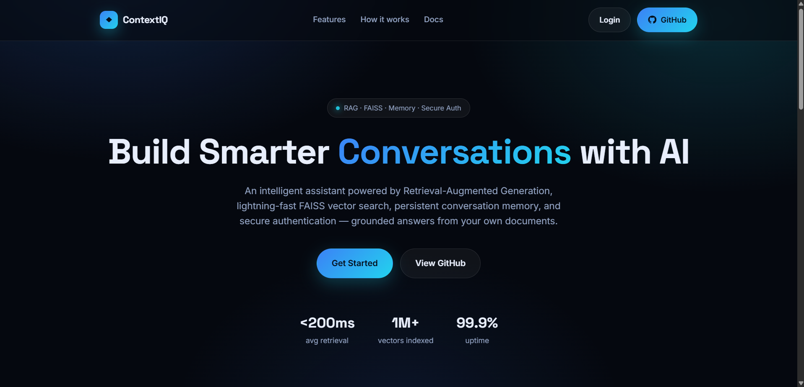
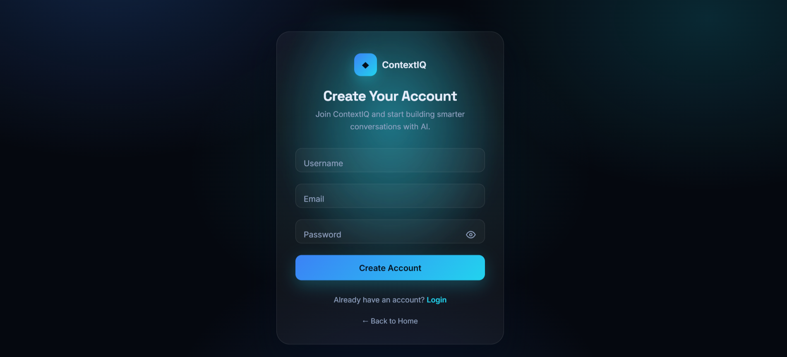
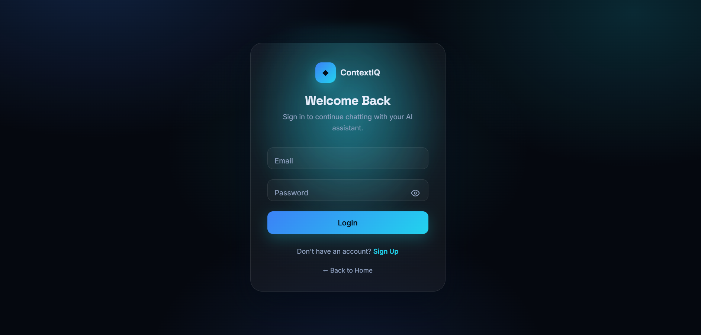
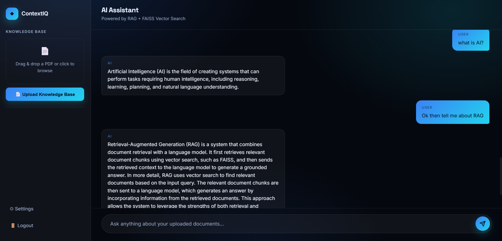

# 🤖 ContextIQ – AI-powered document intelligence platform using Flask, RAG, FAISS, Docker and secure authentication.

An AI-powered **Retrieval-Augmented Generation (RAG)** chatbot that
allows users to upload PDF documents and ask questions grounded in their
content. The application uses **Sentence Transformers** for embeddings,
**FAISS** for vector similarity search, and **Ollama (Llama 3.2)** to
generate context-aware answers through a secure Flask web application.
The application is fully **Dockerized** with persistent storage for uploaded 
documents, FAISS vector indexes, and SQLite-based user and chat data.

------------------------------------------------------------------------

## ✨ Features

-   🔐 JWT-based user authentication
-   📄 Upload PDF documents
-   📚 Automatic PDF text extraction
-   ✂️ Recursive text chunking
-   🧠 SentenceTransformer embeddings
-   ⚡ FAISS vector database for semantic search
-   🤖 Ollama (Llama 3.2) integration
-   💬 Retrieval-Augmented Generation (RAG)
-   🌊 Streaming AI responses
-   🛡️ Flask-Limiter rate limiting
-   🗄️ SQLite database
-   💾 Persistent document and vector-store storage
-   🐳 Dockerized application
-   🔑 Environment-based configuration using .env
-   🎯 Answers based only on uploaded document context
-   🌙 Modern Dark Theme


------------------------------------------------------------------------

## 🛠️ Tech Stack

| Category | Technologies |
|---|---|
| Backend | Flask, Python |
| Database | SQLite, SQLAlchemy |
| Authentication | Flask-JWT-Extended |
| AI | Ollama, Llama 3.2 |
| RAG | LangChain |
| Embeddings | Sentence Transformers |
| Vector Store | FAISS |
| PDF Processing | pypdf |
| Security | Flask-Limiter |
| Containerization | Docker |
| Frontend | HTML, CSS, JavaScript |

---------------------------------------------------------------------------

## 🏗️ System Architecture

``` text
            Upload PDF
                 │
                 ▼
        Extract PDF Text
                 │
                 ▼
      Recursive Text Chunking
                 │
                 ▼
    SentenceTransformer Embeddings
                 │
                 ▼
          FAISS Vector Store
                 │
                 ▼
        User asks a Question
                 │
                 ▼
      Retrieve Relevant Chunks
                 │
                 ▼
         Ollama (Llama 3.2)
                 │
                 ▼
            Generated Answer(Stream Response)
```
```
Docker Architecture
                    Docker Container
                  ┌───────────────────┐
                  │     ContextIQ     │
                  │                   │
                  │ Flask Application │
                  │ Python Dependencies│
                  │ RAG + FAISS       │
                  └─────────┬─────────┘
                            │
             ┌──────────────┼──────────────┐
             │              │              │
             ▼              ▼              ▼
          user.db        uploads/      vector_store/
             │              │              │
             └──────────────┴──────────────┘
                  Persistent Bind Mounts
                            │
                            ▼
                   Windows Host Ollama
                       :11434
```

------------------------------------------------------------------------

## 📂 Project Structure

``` text
AI_Chatbot/
│── app.py
│── database.py
│── main.py
|── .dockerignore
|── Dockerfile
│── requirements.txt
│── templates/
│── static/
│── uploads/
│── vector_store/
└── README.md

```

------------------------------------------------------------------------

## 🚀 Installation

``` bash
git clone <your-repository-url>
cd AI_Chatbot

python -m venv chatbot
chatbot\Scripts\activate

pip install -r requirements.txt
```

Start Ollama and pull the model:

``` bash
ollama pull llama3.2
ollama serve
```

Run the application:

``` bash
python app.py
```

Open:

``` text
http://127.0.0.1:5000
```
------------------------------------------------------------------------
🐳 Docker Setup

ContextIQ can also be run inside a Docker container.

Build the Docker Image

From the project root:

```
docker build -t contextiq .
```
Run the Container

The application uses runtime environment variables and persistent bind mounts for the SQLite database, uploaded documents, and FAISS vector store.

For PowerShell:

```
docker run --env-file .env `
  --mount type=bind,source="${PWD}\uploads",target=/app/uploads `
  --mount type=bind,source="${PWD}\vector_store",target=/app/vector_store `
  --mount type=bind,source="${PWD}\user.db",target=/app/user.db `
  -p 5000:5000 contextiq
```
Open:

```
http://localhost:5000
```
Ollama with Docker

Ollama runs on the host machine while ContextIQ runs inside the Docker container.

The container communicates with Ollama through:
```
http://host.docker.internal:11434
```
The endpoint is configured through:
```
OLLAMA_BASE_URL=http://host.docker.internal:11434
```
This allows the Dockerized application to use the Ollama instance running on the host machine.

------------------------------------------------------------------------

## 📸 Screenshots

### home



### Signup



### Login



### Chat Interface



------------------------------------------------------------------------

## 💡 How It Works
- Register or log in.
- Upload a PDF document.
- The application extracts and chunks the text.
- Embeddings are generated using Sentence Transformers.
- Chunks are indexed in FAISS.
- Ask questions about the uploaded document.
- Relevant chunks are retrieved using semantic similarity.
- Retrieved context is provided to Ollama.
- Ollama generates a grounded response.
- The response is streamed back to the user.
- Chat history is persisted in SQLite.

------------------------------------------------------------------------
## 🔮 Future Improvements
- 🚀 Production deployment
- 🌐 Cloud deployment
- 📊 Monitoring and logging
- 🔐 Role-based access control
- 🐳 Docker Compose configuration
- ⚙️ Production WSGI server
------------------------------------------------------------------------

## 👨‍💻 Author

**Rutendra Mahato**

If you found this project useful, consider giving it a ⭐ on GitHub.
